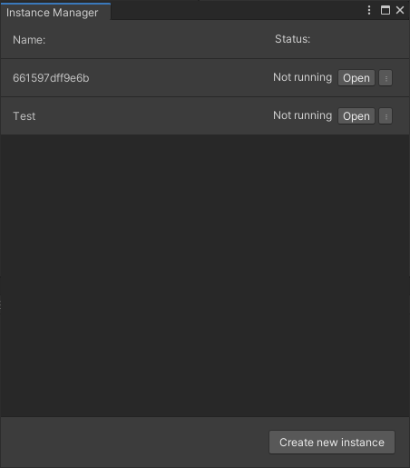

The instance manager window is the primary way of setting up secondary instances.

Instance list:\
Lists all instances added for this project.\
First column displays either Name, or ID, as fallback, if none specified.\
Second column displays the status of the instance, which can be one of the following:
* Not running
* Running
* Needs repair

Button next to status changes depending on the status of the instance, to perform the relevant function.
The menu button (which can also be accessed using right click) has the following buttons:
* Open, Close, Repair - Same as button next to status
* Show in explorer - Opens the instance folder in explorer
* Options - Displays the options for this instance
* Delete - Deletes this instance

Footer:\
Contains the 'Create new instance' button, which will create a new instance when pressed. Be aware that this takes a small amount of time, and progress will be displayed in lower right corner in unity 2020, but in 2019, no progress is shown.

##### Options

The options screen provides options for changing behavior of secondary instances.

* Autosync:\
  Syncs asset databse automatically if checked, otherwise you will need manually to press the refresh button inside the secondary instance
* Display name:\
  The name to display in the instance list
* Preferred layout:\
  The window layout you wish to apply to the secondary instance
* Enter / exit playmode:\
  Automatically enter or exit playmode in secondary instances when primary instance does
* Open scripts in:\
  Primary editor: Open scripts in the editor associated with the primary instance.\
  Secondary editor: Open a editor for each instance.
* Scenes to open:\
  The scenes to open when the unity instance is opened
