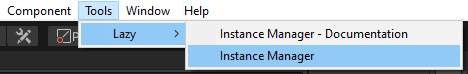

Welcome to Advanced Instance Manager!\
The interface of Advanced Instance Manager is designed to be as intuitive as possible, and while we hope that this guide is not really needed, it is obviously good to have one regardless.

So here we go, lets create and run a secondary instance!

* Open instance manager window:

* Press 'Create new instance' button, to create a new instance\
  Wait while instance is being created, progress is displayed in the lower right corner (unity 2020 and above). When instance is done being created it will appear in the list.
* Press the menu button (or right click) on the instance in the list, and press 'Options...'.\
  Here you may change any settings you wish, refer to [Instance Manager Window](InstanceManagerWindowGuide) for more explanations. Go back using the '←' button in the upper right corner when done.
* Press 'Open' on the instance in the list, the status should change to 'Running'.\
  Wait until new instance opens (it should open up on top, but may obviously appear behind primary instance / other windows if you're clicking around, so check taskbar too).
* Once the secondary unity instance has opened, the window may flash due too changing the window layout, this is normal and not really fixable.
  The Instance Manager window will automatically open, with the options screen for this instance visible (but with a few differences to account for actually being inside the instance).
* Enter playmode in primary instance, assuming you did not disable 'Enter / exit playmode when primary does' in options, you should now see the secondary instance also entering playmode.\
  Pressing pause in primary instance will also pause in secondary (this is controlled by enter playmode setting, by the way). Unpausing or exiting playmode in primary instance should of course also do the same in the secondary instance.

And with that we're done, you can now create more instances, experiment with options, check out the API and debug your multiplayer games with ease!

That said though, if there is anything that did not go as planned, please contact us at any of the links described in the contacts section in [Home](home), that would be a bug :)
